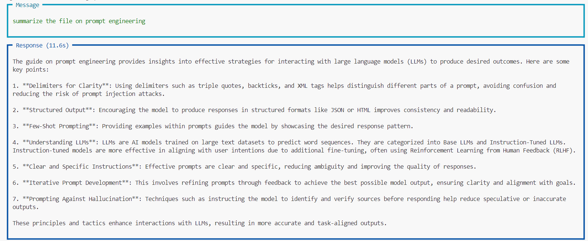
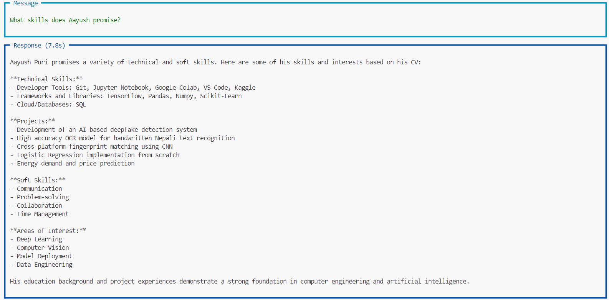

# **Document-based RAG (Retrieval-Augmented Generation) System**

This project demonstrates how to build a **Retrieval-Augmented Generation (RAG)** system using the **Agno** library, **LanceDB**, and **OpenAI Embedding** for document ingestion, knowledge base creation, and querying. It enables querying over a collection of documents (such as PDFs) and generating answers based on the retrieved knowledge.

---

## **Features**

- **Document Ingestion**: Ingest PDF documents and convert them into a queryable knowledge base.
- **Knowledge Base**: Build a knowledge base that can be queried using a simple interface.
- **Query System**: Query the knowledge base with natural language questions, with answers generated from relevant document snippets.

---

## **Getting Started**

### **1. Clone the Repository**

Clone the repository to your local machine:

```bash
git clone git@github.com:aayush-puri-01/RAG-GENAI.git
cd RAG-GENAI
```

### **2. Instal Dependencies**

Install the required libraries by running the following command:

```bash
pip install -r requirements.txt
```

### **3. Prepare Your Documents**

Place your PDF documents in the `data/raw/` directory. These PDFs will be ingested and used to create the knowledge base.

```bash
# Example:
knowledge/
└── raw/
    ├── document1.pdf
    ├── document2.pdf
    └── ...
```

### **4. Build the Knowledge Base**

To create the knowledge base from your documents, run the following script:

```bash
python src/knowledgebase.py
```

### **4. Interact with the Knowledge Base**

After building the knowledge base, you can interact with it using the main.py script. This script allows you to ask questions and get responses based on the documents in your knowledge base.

To run the interactive query system, use:

```bash
python src/main.py
```

## **Outputs**




